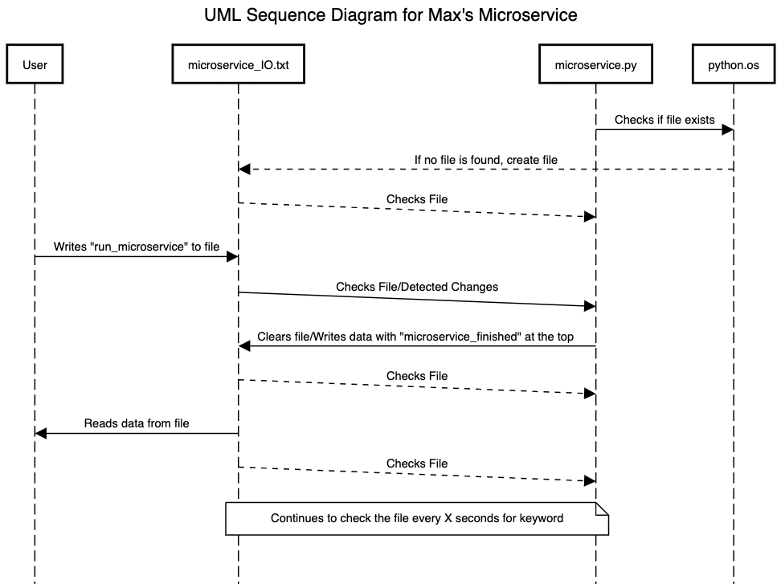

# Microservice for Max

This is a microservice for Max that allows you to send and receive messages from a text file `microservice_IO.txt` in 
the same directory as the Python file

## Request Data
**Trigger Word:** `run_microservice`

To request data from this microservice, write `run_microservice` to the text file `microservice_IO.txt`.
This will run the microservice and run the code required for the microservice to work

## Receive Data
The microservice will send data to the text file `microservice_IO.txt`.
The data will be stored in this file for any other script to read and handle accordingly.

## UML Sequence Diagram
